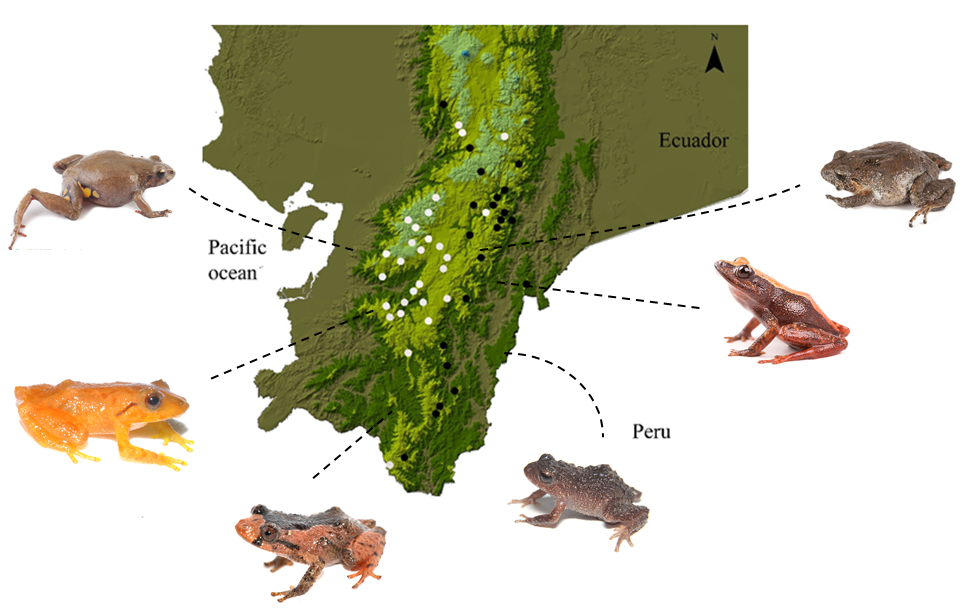
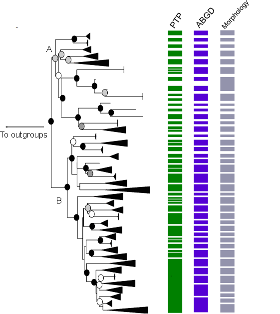
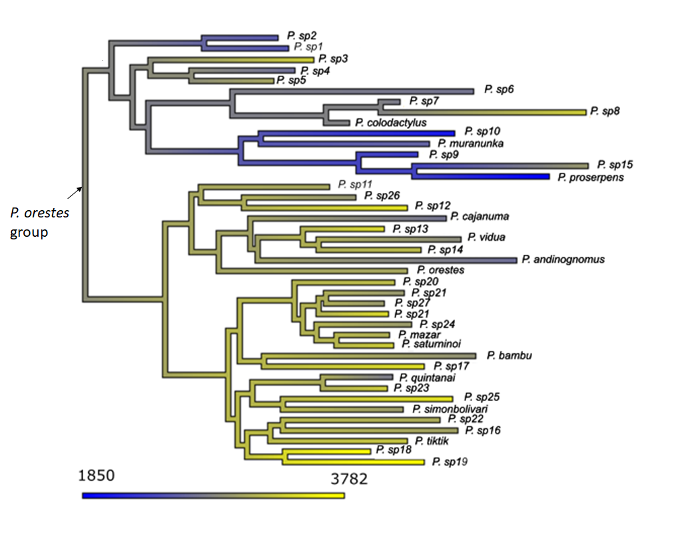
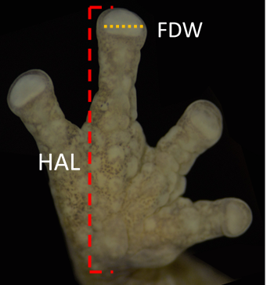

# Data overview and database construction {#pristis}

This proyect is focused on exploring questions regarding patterns and process of diversification is the *Pristimantis orestes* species complex which is distributed across the Páramo landscape and montane forests in the eastern and western slopes of southern Ecuador. To achieve this,  I used morphological, behavioral, biogeographical and molecular evidence to delimit species within the group.
Next, I used the molecular phylogeny, habitata and morphological data to  explore
the drivers of genetic and morphological diversification


---

```{r plot1, fig.cap= "Map of southern Ecuador, showing some representative members of the *P. orestes* group", fig.align="center", echo=FALSE, dpi=70}

```


## The data 

The data from this project includes the following:

1. **Morphometric data** obtained from external structures measured to the neares 0.1mm. Acronyms follow Waters et al. (2016)
    + eye to nostril distance (EN)
    + head length (HL)
    + head width (HW)
    + interorbital distance (IOD)
    + internarial distance (IND)
    + snout vent length (SVL)
    + tibia length (TL)
    + foot length (FL)
    + tympanum diameter (TD)
    + eye diameter (ED) 
    + upper eyelid width (EW)
    + Toe pad width (TDW)
    + Finger pad width (FDW)
    + HAND lenght (HANDL)
    + Finger IV lenght (Finger.width)
    
2. **Natural history data** for each recorded invidual obtained from direct observations in  field, museum data bases and the map of continental ecosystems from the Ecuadorean environmental ministry. 
    + Ecosystem
    + microhabitat
    
  
3. **Molecular data** from sanger sequencing of two mithocondrial and one nuclear genes
    + 12S
    + 16H single fragment aligned reads
    + 16SC single fragment aligned
    + Rag-1
    + 16S combined fragments 
    
4. **Geographical data** obtained from museum records, field journals from collectors or taken directly in the field with a GPS 
    + locality
    + coordinates x
    + coordinates y
    + elevation m

## Data base structure

The data base structure for SQLite is based on 5 tables. The reference column in every table is the *museum_code*, which if formed by the acronyms of each museum collection followed by a 3 to 7 digits number.


```{r plot2, fig.cap= "Data base structure", fig.align="center", out.height="200%", echo=FALSE, dpi=80}
knitr::include_graphics("figure2.png")
```

Calling packages needed for data organization and analysis

```{r calling, warning=FALSE, message=FALSE}
library(DBI)
library(RSQLite)
library(tidyverse)
library(viridis)
library(ggtree)
library(treeio)
library(tidytree)
library(patchwork)
library(ape)
library(phytools)


```

```{r setwd, echo=FALSE}
setwd("C:/Users/Veronica/Documents/comp_tools/pristimantis")
```
Creating orestes.db

```{r calling2}
orestes_db <- dbConnect(RSQLite::SQLite(), "orestes.db")
```

### Table 1 General information

This table includes five rows and has general data from each collected invididual including the museum_id, sex, age class, species name, and museum collection name. 

```{r PRISTIMANTIS, eval=FALSE, warning=FALSE, message=FALSE, results='hide'}
dbExecute(orestes_db, "CREATE TABLE pristimantis (
museum_id varchar(10) NOT NULL,
sex char(3) CHECK (sex IN ('M', 'F', 'NA')),
age_class varchar(8) CHECK (age_class IN ('Juvenile', 'Subadult', 'Adult', 'NA')),
species varchar(50),
museum_collection varchar (10),
PRIMARY KEY (museum_id)
);")

```

Calling data from csv sheet

```{r data pristimantis}
pristimantis <- read.csv("1_pristimantis.csv", fileEncoding="UTF-8-BOM", 
                   stringsAsFactors = FALSE) 

names(pristimantis)
```

Entering data into database

```{r data pristimantis1 }
dbWriteTable(orestes_db, "pristimantis", pristimantis, append = TRUE)

dbGetQuery(orestes_db, "SELECT * FROM pristimantis LIMIT 6;")

```

### Table 2 Records

This table includes specific sampling point, locality name, province, date of collection,  collectors name, geographic coordinates and elevation


```{r records, eval=FALSE, warning=FALSE, message=FALSE, results='hide'}
dbExecute(orestes_db, "CREATE TABLE records (
record_id INTEGER PRIMARY KEY AUTOINCREMENT,
museum_id varchar(10) NOT NULL,
sampling_point varchar (75),
locality varchar (50),
province varchar (20),
date varchar (10),
coordinates_y double,
coordinates_x double,
elevation double,
collector varchar (150),
FOREIGN KEY (museum_id) REFERENCES pristimantis(museum_id)
);")

```

Calling data from csv sheet

```{r data records}
records <- read.csv("2_records_new.csv", fileEncoding="UTF-8-BOM", 
                   stringsAsFactors = FALSE) 

names(records)
```

Entering data into database

```{r data records1 }
dbWriteTable(orestes_db, "records", records, append = TRUE)

dbGetQuery(orestes_db, "SELECT * FROM records LIMIT 6;")

```


### Table 3 Molecular data

This data table contains a sequence_id, museum_id, 12S base pairs, 16S base pairs, RAG-1 base pairs. 


```{r molecular, eval=FALSE, warning=FALSE, message=FALSE, results='hide'}
dbExecute(orestes_db, "CREATE TABLE molecular_dat (
record_id INTEGER PRIMARY KEY AUTOINCREMENT,
museum_id varchar(10) NOT NULL,
gene_12s integer,
fragment_16sc integer,
fragment_16h integer,
gene_RAG_1 integer,
FOREIGN KEY (museum_id) REFERENCES pristimantis(museum_id)
);")

```

Calling data from csv sheet

```{r data molecular}
molecular <- read.csv("3_molecular_data.csv", fileEncoding="UTF-8-BOM", 
                   stringsAsFactors = FALSE) 

names(molecular)
```

Entering data into database

```{r data molecular1 }
dbWriteTable(orestes_db, "molecular_dat", molecular, append = TRUE)

dbGetQuery(orestes_db, "SELECT * FROM molecular LIMIT 6;")

```

```{r plot3, fig.cap= "Multigene phylogenetic tree of *Pristimantis orestes*", fig.align="center", out.height="200%", echo=FALSE, dpi=80}

```

### Table 4 Natural history 

This data table contains information regarding the microhabitat and substrate were each individual was found. 


```{r habitat, eval=FALSE, warning=FALSE, message=FALSE, results='hide'}
dbExecute(orestes_db, "CREATE TABLE habitat (
habitat_id INTEGER PRIMARY KEY AUTOINCREMENT,
museum_id varchar(10) NOT NULL,
ecosystem varchar (50), 
microhabitat varchar (100), 
FOREIGN KEY (museum_id) REFERENCES pristimantis(museum_id)
);")

```

Calling data from csv sheet

```{r data habitat}
habitat <- read.csv("4_habitat.csv", fileEncoding="UTF-8-BOM", 
                   stringsAsFactors = FALSE) 
names(habitat)
```

Entering data into database

```{r data habitat1 }
dbWriteTable(orestes_db, "habitat", habitat, append = TRUE)

dbGetQuery(orestes_db, "SELECT * FROM habitat LIMIT 6;")

```

### Table 5 Morphometrics

This data table contains morphometrics measurements from external characters. All measurements are rounded to the near 0.1mm and follow the definitions of Duelman & Lehr (2009) and Watters et al. (2016)


```{r morphometrics, eval=FALSE, warning=FALSE, message=FALSE, results='hide'}
dbExecute(orestes_db, "CREATE TABLE morphometrics (
measurement_id INTEGER PRIMARY KEY AUTOINCREMENT,
EN_mm float,
TD_mm float,
ED_mm float,
EW_mm float,
IOD_mm float,
HL_mm float,
HW_mm float,
SVL_mm float, 
TL_mm float, 
FDW_mm float,
TDW_mm float,
HANDL_mm float,
finger.width_mm,
FOREIGN KEY (museum_id) REFERENCES pristimantis(museum_id)
);")

```

Calling data from csv sheet

```{r data morphometrics}
morphometrics <- read.csv("5_morphometrics.csv", fileEncoding="UTF-8-BOM", 
                   stringsAsFactors = FALSE) 

names(morphometrics)
```

Entering data into database

```{r data morphometrics1 }
dbWriteTable(orestes_db, "morphometrics", morphometrics, append = TRUE)

dbGetQuery(orestes_db, "SELECT * FROM morphometrics LIMIT 6;")

```

# Systematics of Pristimantis in the ecuadorean Andes

The phylogenetic analysis includes newly generated sequences from  individuals collected during field surveys. Figure \@ref(fig:Fig3) shows the number of gene fragments amplified in my study. Fragments of the 16S mithocondrial gene were amplified for all individuals whereas fragments of 12s and RAG-1 were obtained for 148 and 115 individuals respectively. The final dataset for the analysis includes 222 genetically unique individuals. 

```{r Fig3, fig.cap = "Gene fragments amplified from collected individuals", message=FALSE, fig.align="center"}
data1 <- molecular %>%  
  mutate(gene_16s = ifelse(fragment_16sc > 1 || fragment_16h > 1, 1, 0)) %>% 
  select(-fragment_16sc, -fragment_16h) %>% 
  pivot_longer(cols = starts_with("gene"),
               names_to = "fragments",
               values_to = "bp",
               values_drop_na = TRUE)

graph3.1 <- ggplot(data = data1, aes(x = fragments, fill = fragments)) +
  geom_bar(stat = "count") +
  scale_fill_viridis(discrete = T) +
  theme_classic() +
  labs(x = "Amplified Gene fragments" , y = "Individuals") +
  theme(legend.position = "none")
  
graph3.1


```

The *P. orestes* species group forms a well-supported monophyletic 
clade that include  13 previously described species in the *P. orestes* group as
well as 27 new candidate species. Figure \@ref(fig:tree) shows a fragment of the phylogenetic tree of P. orestes representing the evolutionary relationships of *P. muranunka*, *P. colodactylus* and eight new candidate species found in southern Ecuador.

```{r tree, fig.cap= "Fragment of the phylogeny of P. orestes ", out.width= '100%', fig.width=50, fig.height= 35, fig.align='center'}


mltree <- read.tree("final_iqMF.merge.contree")

to_drop <- c("QCAZ27653", "AES2439", "MZUA2392", "MZUA785",
           "MZUA2366", "MZUA3012", "MZUA3012", "QCAZ61154", "MZUA2514",
           "MZUA1763", "VLU397", "MECN13062")

ml_reduced <- drop.tip(mltree, to_drop)

tree_orestes <- extract.clade(ml_reduced, node = 423)

nodes <- c("58", "59")

ggtree(tree_orestes, ladderize = FALSE, size = 1) +
  geom_tiplab(size = 9) + 
  geom_point2(aes(subset = (node == 69)), shape = 21,
              fill = 'black', size = 10) +
   geom_point2(aes(subset = (node == 67)), shape = 21,
              fill = 'black', size = 10) +
  geom_point2(aes(subset = (node == 64)), shape = 21,
              fill = 'black', size = 10) +
  geom_point2(aes(subset = (node == 64)), shape = 21,
              fill = 'black', size = 10) +
  geom_point2(aes(subset = (node == 62)), shape = 21,
              fill = 'black', size = 10) +
  geom_point2(aes(subset = (node == 60)), shape = 21,
              fill = 'black', size = 10) +
  geom_point2(aes(subset = (node == 59)), shape = 21,
              fill = 'black', size = 10) +
  geom_point2(aes(subset = (node == 58)), shape = 21,
              fill = 'black', size = 10) +
  geom_point2(aes(subset = (node == 54)), shape = 21,
              fill = 'black', size = 10) +
  geom_point2(aes(subset = (node == 42)), shape = 21,
              fill = 'black', size = 10) +
  geom_point2(aes(subset = (node == 41)), shape = 21,
              fill = 'black', size = 10) +
  geom_point2(aes(subset = (node == 66)), shape = 21,
              fill = 'black', size = 10) +
  geom_point2(aes(subset = (node == 61)), shape = 21,
              fill = 'black', size = 10) +
  geom_point2(aes(subset = (node == 36)), shape = 21,
              fill = 'black', size = 10) +
  geom_point2(aes(subset = (node == 38)), shape = 21,
              fill = 'black', size = 10) +
  geom_point2(aes(subset = (node == 40)), shape = 21,
              fill = 'black', size = 10) +
  geom_point2(aes(subset = (node == 52)), shape = 21,
              fill = 'black', size = 10) +
  geom_point2(aes(subset = (node == 39)), shape = 21,
              fill = 'black', size = 10) +
  geom_cladelabel(node = 69, label = "P. sp1", color = "gold",
                  offset = 0.004, , align = TRUE, fontsize = 14, barsize = 3) +
  geom_cladelabel(node = 67, label = "P. sp2", color = "black",
                  offset = 0.004, , align = TRUE, fontsize = 14, barsize = 3) +
  geom_cladelabel(node=64, label = "P. colodactylus", color = "gold",
                  offset = 0.004, , align = TRUE, fontsize = 14, barsize = 3) +
  geom_cladelabel(node = 62, label = "P. sp3", color = "black",
                  offset = 0.004, , align = TRUE, fontsize = 14, barsize = 3) +
  geom_cladelabel(node = 60, label = "P. sp4", color = "gold",
                  offset = 0.004, , align=TRUE, fontsize = 14, barsize = 3) +
  geom_cladelabel(node = 59, label = "P. sp5", color = "black",
                  offset = 0.004, , align = TRUE, fontsize = 14, barsize = 3) +
  geom_cladelabel(node = 58, label = "P. sp6", color = "gold",
                  offset = 0.004, , align=TRUE, fontsize = 14, barsize = 3) +
  geom_cladelabel(node = 54, label="P. muranunka", color = "gold",
                  offset = 0.004, , align = TRUE, fontsize = 14, barsize = 3) +
  geom_cladelabel(node=42, label = "P. sp7", color = "black",
                  offset = 0.004, , align = TRUE, fontsize = 14, barsize = 3) +
  geom_cladelabel(node = 41, label = "P. sp8", color = "gold",
                  offset = 0.004, , align=TRUE, fontsize = 14, barsize = 3)
  

```

# Distribution of Pristimantis across ecosystems 

The *P. orestes* species group has a widespread distribution in the southern region of the Ecuadorean Andes, encompassing 11 different ecosystems  in an elevational range between 1850 and 3800 m. Based on our phylogeographic and delimitation results (including the candidate species), higher species diversity is found in
the eastern montane forest and paramo ecosystems (Figure \@ref(fig:plot)), which 
are the highest elevation habitats in southern Ecuador.   Most species in the *P. orestes* species group are restricted to a single ecosystem and present narrow distributions, except for six species  that were recovered across two different ecosystems, and three species  that presented widespread 
environmental distributions occurring across three distinct ecosystems. 

```{r plot, fig.cap= " Species distribuited by ecosystem. The ecosystems names follow the original nomenclature of MAE (2012) ", out.width= '100%',  fig.align='center'}

data2 <- habitat %>% 
    left_join(pristimantis, by = "museum_id") %>% 
    group_by(ecosystem) %>% 
    summarise(species_number = n_distinct(species)) 


graph4.1 <- ggplot(data = data2, aes(x = ecosystem,                                       y = species_number, fill = ecosystem, na.rm = TRUE)) +
    geom_bar(stat = "identity") +
    theme_classic() +
    labs(x = "Ecosystem" , y = "number of species") +
    theme(legend.position = "none") +
    theme(axis.text.x = element_text(angle = 45, hjust = 1)) +
    scale_fill_viridis(discrete = T) 
    
  
  graph4.1
  

```

Across elevational gradients I found that closely related members of the group 
tend to strongly resemble each other in their average elevational occurrence. 
Figure \@ref(fig:plot4) shows the ancestral state reconstruction analysis of elevation, the analysis supports a mid-elevation origin of the *P. orestes* group. This origin is congruent with the mid elevation range of the evergreen  montane and high montane forest of the eastern Andes where we found the highest species richness in the group Figure \@ref(fig:plot)

```{r plot4, fig.cap= "Reconstructed phylogeny of the average elevation in the P. orestes group", fig.align="center", echo=FALSE, dpi=70}

```


# Phenotypic variation across enviromental gradients

One of the most recognizable morphological features across members of the *P. orestes* group is their hand morphology. In other small terrestrial vertebrates such as Anoles, hand morphology has been associated with adaptations to specific michohabitats. Here, I want to explore if variations in hand morphology across 
the group are correlated with elevation. To capture this notorious variation I 
am using a ratio between the finger disc width and the total hand length. This metric was measured as seen in figure \@ref(fig:hand).


```{r hand, fig.cap= "FDW/HANDL ratio", fig.align="center", echo=FALSE, dpi=70}

```


```{r phenotype}
data5 <- pristimantis %>% 
    left_join(morphometrics, by = "museum_id") %>% 
    left_join(records, by = "museum_id") %>% 
    filter(HANDL_mm > 0 & Finger.width_mm >0 & elevation >1) %>% 
    mutate(hand = Finger.width_mm/HANDL_mm) %>% 
    group_by(species) %>% 
    summarise(hand_value = mean(hand), altitude = mean(elevation)) 

m1 <- lm(formula = altitude ~ hand_value, data = data5)

pred <- predict(m1, se.fit = TRUE)
  
preds <- data.frame(mean = pred$fit,
                      upr = pred$fit + 1.96 * pred$se.fit,
                      lwr = pred$fit - 1.96 * pred$se.fit)
  

```

Figure \@ref(fig:elev) shows a significant correlation between Altitude and 
the FDW/HANDL ratio. In other amphibian groups such as tree frogs, broader disc pads have been correlated with increasing adhesion to surfaces such as leaves,thus it is possible that this characteristic in some members of the *P. orestes* group is also associated with habitat specializations, that are characteristic of habitats found at lower elevations in the Andes such as bromelids. However, detailed microhabitat information from species recovered as part of the P. orestes 
group are needed to further link morphological traits to specific microhabitat features.


```{r elev, fig.align="center", fig.cap= "Correlation between FDW/HANDL ratios and elevation"}
graph5.1 <- data5 %>% 
    ggplot(mapping = aes(x = hand_value, y = altitude)) +
    geom_ribbon(aes(ymin = preds$lwr, ymax = preds$upr), fill = "gray90") +
    geom_line(aes(y = preds$mean), color = "darkmagenta", size = 0.8) + 
    geom_point(color = "darkmagenta", alpha = 0.5) +
    labs(x = "FDW/HANDL", y = "Altitude") +
    theme_minimal() 
  
graph5.1
```

